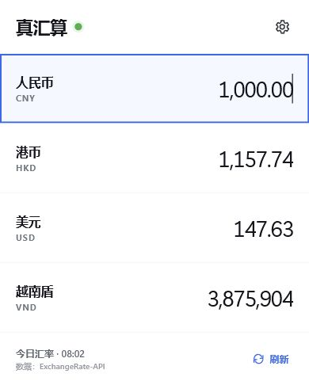
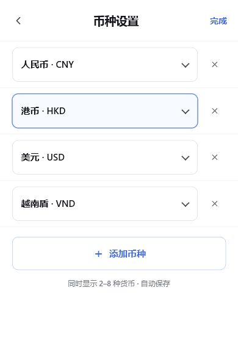

# 真汇算

一个极简、开源的 Chrome / Edge 汇率换算扩展。

无需先选择“从哪种货币换到哪种货币”：直接在任意货币框中输入数字，其他货币会立即联动换算。币种和数量都可自由调整，同时显示 2–8 种货币。

> 当前仅通过 GitHub 开源分发，不在 Chrome / Edge 扩展市场上架。请从 Releases 下载 ZIP，解压后使用浏览器“开发者模式”加载。



## 特点

- 任意货币框输入，其他结果即时联动
- 默认显示人民币、港币、美元、越南盾
- 支持约 165 种货币，可增加、删除和替换
- 支持常见千分符、全角数字和粘贴格式：
  - `1,234.56`
  - `1.234,56`
  - `1 234 567,89`
  - `26.252.670`（零小数货币）
  - `￥１，２３４．５６`
- 自动保存币种设置和上次输入
- 汇率缓存到本地；断网时可继续使用最近一次成功数据
- 不读取网页，不收集浏览记录，不含广告
- Manifest V3，只有 `storage` 和汇率接口两项必要权限

> “即时”指输入后的换算结果立即更新。免费数据源提供的是最新每日参考汇率，并非逐秒交易报价；银行、支付平台和报关结算价可能不同。

## 安装

### 从源码安装

1. 下载本仓库并解压。
2. 打开 Chrome 的 `chrome://extensions`，或 Edge 的 `edge://extensions`。
3. 打开“开发者模式”。
4. 点击“加载已解压的扩展程序”。
5. 选择本项目根目录。

### 从发布包安装

1. 在 [Releases](https://github.com/Cartmancxx/zhen-huisuan/releases) 下载最新 ZIP。
2. 将 ZIP 完整解压到一个固定文件夹。
3. 打开 Chrome 的 `chrome://extensions`，或 Edge 的 `edge://extensions`。
4. 打开“开发者模式”，点击“加载已解压的扩展程序”。
5. 选择刚才解压出的文件夹。

浏览器不会自动更新这种手动加载的扩展；有新版本时，请重新下载并覆盖文件，然后在扩展管理页点击“重新加载”。

## 使用

1. 点击工具栏里的“真汇算”。
2. 在任意一行输入金额。
3. 点击右上角齿轮，可替换、增加或删除币种。
4. 按 `Esc` 清空；按 `↑` / `↓` 快速切换输入框。



## 汇率来源

项目使用 [ExchangeRate-API Open Access](https://www.exchangerate-api.com/docs/free)：

```text
https://open.er-api.com/v6/latest/USD
```

该接口无需 API Key，官方说明为每日更新并要求署名。插件只在缓存到期或用户点击“刷新”时请求接口。

## 隐私与权限

- `storage`：保存汇率缓存、币种设置和上次输入。
- `https://open.er-api.com/*`：读取公开汇率 JSON。

插件没有 content script，不读取或修改网页，不收集个人数据。完整说明见 [PRIVACY.md](PRIVACY.md)。

## 开发

环境要求：Node.js 20+。

```powershell
npm install
npm test
npm run icons
```

本地预览：

```powershell
npm run serve
```

然后访问 `http://127.0.0.1:8765/popup.html`。

## 贡献

欢迎提交 Issue 和 Pull Request。开始前请阅读 [CONTRIBUTING.md](CONTRIBUTING.md) 与 [CODE_OF_CONDUCT.md](CODE_OF_CONDUCT.md)。

维护者发布新版本时请参照 [PUBLISHING.md](PUBLISHING.md)。

## 许可证

[MIT License](LICENSE)
