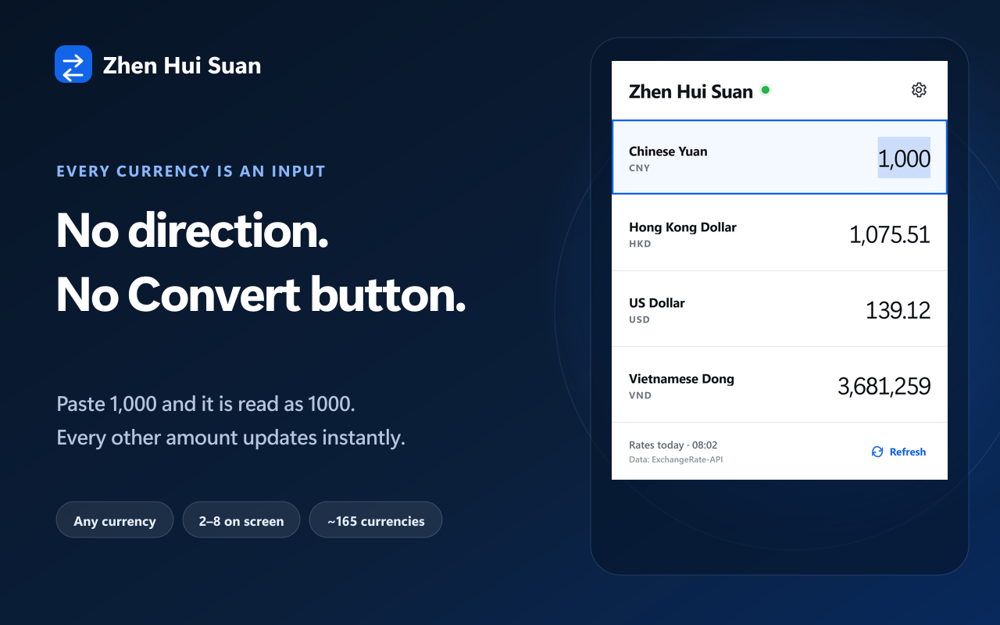
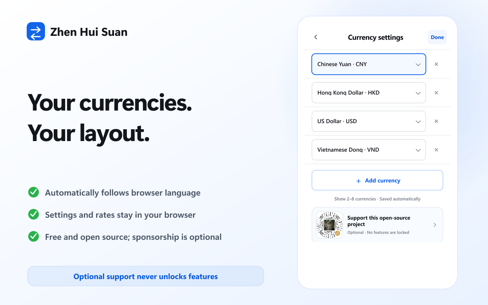
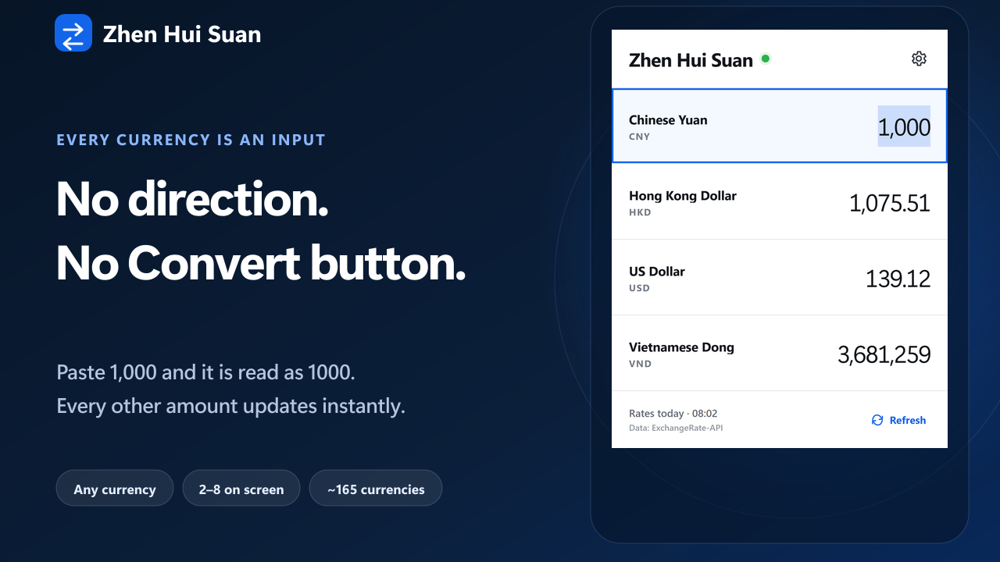

# Zhen Hui Suan

[简体中文](README.md) · [English](README_EN.md)

A minimal, open-source multi-currency converter for Chrome and Edge.

There is no “from” or “to” selector. Enter an amount in any currency field and every other field updates immediately. You can show 2–8 currencies and freely add, remove, or replace them.

> Zhen Hui Suan is now live on the Chrome Web Store. The Microsoft Edge Add-ons package, four localized listings, and promotional assets are also ready; GitHub Releases remains available while the Edge listing is under review.

[Install from the Chrome Web Store](https://chromewebstore.google.com/detail/zhen-hui-suan/lbhpoliodgeipgbpbjlhfcniiipcpndj) · [Watch the promo on YouTube](https://www.youtube.com/watch?v=aU-nN0AAS9w)



## Features

- Use any currency field as the conversion source
- Defaults to CNY, HKD, USD, and VND
- Supports about 165 currencies from the exchange-rate source
- Recognizes common pasted number formats:
  - `1,234.56`
  - `1.234,56`
  - `1 234 567,89`
  - `26.252.670` for zero-decimal currencies
  - Full-width digits and currency symbols
- Remembers your currency list and most recent input
- Keeps a local rate cache for temporary offline use
- No ads, accounts, analytics, or access to web pages
- Manifest V3 with only `storage` and the exchange-rate host permission

> “Instant” describes the linked calculation after typing. The free data source provides the latest daily reference rates, not tick-by-tick trading quotes. Bank, payment-platform, and customs settlement rates may differ.

## Languages

The interface automatically follows the browser UI language:

- Simplified Chinese
- Traditional Chinese
- English
- Vietnamese

Unsupported languages fall back to English. Currency names, number formatting, status messages, and accessibility labels all follow the selected interface locale.

## Install

### Chrome Web Store

[Install Zhen Hui Suan from the Chrome Web Store](https://chromewebstore.google.com/detail/zhen-hui-suan/lbhpoliodgeipgbpbjlhfcniiipcpndj). Store installations update automatically.

### Microsoft Edge Add-ons

The Edge listing package is ready. Its public store link will be added after approval.

### From a Release

1. Download the latest ZIP from [Releases](https://github.com/Cartmancxx/zhen-huisuan/releases).
2. Extract the complete ZIP into a permanent folder.
3. Open `chrome://extensions` in Chrome or `edge://extensions` in Edge.
4. Enable **Developer mode**.
5. Choose **Load unpacked** and select the extracted folder.

Manually loaded extensions do not update automatically. For a new version, download it again, replace the files, and click **Reload** on the browser's extension-management page.

### From source

Clone or download this repository, then load the repository root with **Load unpacked**.

## Use

1. Open Zhen Hui Suan from the browser toolbar.
2. Enter an amount in any row.
3. Open the gear menu to add, remove, or replace currencies.
4. Press `Esc` to clear values and `↑` / `↓` to move between fields.



## Exchange-rate source

The project uses [ExchangeRate-API Open Access](https://www.exchangerate-api.com/docs/free):

```text
https://open.er-api.com/v6/latest/USD
```

It requires no API key. The provider documents daily updates and requires attribution, so the extension refreshes only when the cache expires or when you explicitly press Refresh.

## Privacy and permissions

- `storage`: Stores the rate cache, currency selection, and most recent input locally.
- `https://open.er-api.com/*`: Reads the public exchange-rate JSON.

There is no content script. The extension does not read or modify web pages and does not collect personal data. See [PRIVACY_EN.md](PRIVACY_EN.md).

## Support the project

Zhen Hui Suan is free and fully open source. Sponsorship never unlocks features and is never required. If the extension saves you time, you may optionally buy the maintainer a coffee:


The extension only displays this local image. It cannot read or upload payment information.

## Development

Requires Node.js 20 or later.

```powershell
npm install
npm test
npm run serve
```

Open `http://127.0.0.1:8765/popup.html?lang=en` to preview the English interface.

## Contributing

Issues and pull requests are welcome. Please read [CONTRIBUTING.md](CONTRIBUTING.md) and [CODE_OF_CONDUCT.md](CODE_OF_CONDUCT.md).

## Promotional video

The video demonstrates real any-field input, `1,000` parsing, linked four-currency conversion, automatic language, and optional sponsorship. See [video/README.md](video/README.md) for the reproducible Remotion project.

Store upload steps, asset paths, and privacy answers are documented in [STORE_SUBMISSION_GUIDE.md](STORE_SUBMISSION_GUIDE.md).

[](https://www.youtube.com/watch?v=aU-nN0AAS9w)

[Download the Chinese MP4](store-assets/video/zh-CN/zhen-huisuan-promo-zh.mp4) · [Download the English MP4](store-assets/video/en/zhen-huisuan-promo-en.mp4)

## License

[MIT License](LICENSE)
